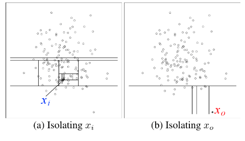

# Isolation Forest Algorithm Implementation

Isolation Forest is a method of anomaly detection first described in this paper: https://cs.nju.edu.cn/zhouzh/zhouzh.files/publication/icdm08b.pdf

The essence of the Isolation Forest algorithm is: anomalies are more susceptible to isolation. Thus, fewer 'cuts' are required to isolate this anomaly, and is how the algorithm works.